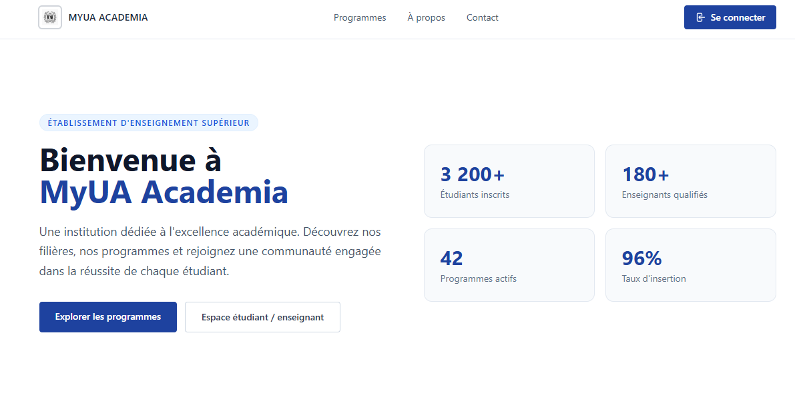

# MyUAAcademia
<p align="center">
  <a href="https://myuaacademia.up.railway.app/home" target="_blank" rel="myua">
    <picture>
      
    </picture>
  </a>
</p>
<br/>
<p align="center">
  <!-- Backend -->
  
  
  

  <!-- Frontend -->
  
  

  <!-- Database & Deploy -->
  
  
</p>
<br/>
Plateforme de gestion académique multi-rôles (étudiant, professeur, admin)


## 🚀 Demo
https://myuaacademia.up.railway.app/home


## ✨ Fonctionnalités
### 🌐 Public
- Page d'accueil avec présentation des filières et modal de sélection de rôle
- Formulaire d'admission multi-étapes (identité, coordonnées, programmes, mot de passe, documents)
- Paiement des frais d'admission (120 $) avec autofill
- Confirmation de dossier avec reçu et prochaines étapes

---

### 🎓 Espace Étudiant
- Dashboard avec statistiques académiques et événements à venir (fictives)
- Inscription aux cours avec détection de conflits horaires, panier et limite de 5 cours/session
- Abandon de cours depuis la page d'inscription
- Facturation par session : sous-total cours + frais fixes (assurance, sports, dentaire...)
- Historique des factures avec accordéon et badge solde/réglée
- Paiement de facture
- Bulletin de notes par session et par programme, badges de mention colorés (A+ → E)
- Cheminement académique : grille de cours avec statut Réussi / En cours / À prendre et barre de progression
- Calendrier hebdomadaire des cours avec ligne "maintenant"

---

### 👨‍🏫 Espace Professeur
- Dashboard avec aperçu des cours assignés cette session
- Navigation drill-down Niveau → Programme → Cours → Liste des étudiants inscrits
- Planning académique hebdomadaire (cours assignés)
- Saisie des notes par select de mention (A+, A, B+... E, EXE, I, S)
- Barre de progression de saisie par cours (fictive)
- Consultation des disponibilités de salles par session / jour / plage horaire

---

### 🛠️ Espace Admin / Employé
- Dashboard avec vue d'ensemble chiffrée et actions rapides
- **Employés**
  - Liste avec filtre par département (pills dynamiques) et recherche multi-critères
  - Section "Dossiers en attente de validation" accordéon avec validation en un clic
  - Activation / désactivation de compte (Switch indépendant par ligne)
  - Création d'employé avec sélecteur de contrat et auto-remplissage des champs du poste
- **Contrats**
  - Gestion des postes ouverts (CRUD)
- **Programmes & Cours**
  - Gestion des programmes par niveau
  - Gestion des cours et des séances (salle, horaire, session)
  - Inscription des étudiants aux programmes
  - Inscription des étudiants aux cours
  - Attribution des professeurs aux séances
- **Salles**
  - CRUD des salles
- **Planning établissement**
- **Étudiants**
  - Liste avec recherche étendue
  - Validation / refus de dossier étudiant

---

### 🔐 Transversal
- Authentification JWT avec gestion de session
- Routing protégé par rôle (student / professor / employee / admin)
- Sidebar unique adaptative selon le rôle connecté
- Indicateur de force du mot de passe + règles de complexité sur tous les formulaires auth
- Alertes inline (succès / erreur / warning) en remplacement des `alert()` natifs


## 🛠 Stack technique
- Frontend : React, Vite, Axios
- Backend : C# ASP.NET Core, Entity Framework
- DB : PostgreSQL (prod), SQL Server (local)
- Déploiement : Azure, Railway, Vercel, Render, Neon


## 📋 Prérequis
- [Node.js](https://nodejs.org/) v18+
- [.NET 9 SDK](https://dotnet.microsoft.com/download)
- [SQL Server](https://www.microsoft.com/sql-server) + SSMS
- [Visual Studio 2022](https://visualstudio.microsoft.com/)
- [Visual Studio](https://visualstudio.microsoft.com/thank-you-downloading-visual-studio/?sku=Community&channel=Stable&version=VS18&source=VSLandingPage&cid=2500&passive=false)
- [Postgres](https://www.tigerdata.com/go/best-postgres-db?igaag=195097200220&igaat=&igacm=23666553031&igacr=800632907665&igakw=postgresql&igamt=e&igant=g&default_plan=performance&utm_medium=cpc&utm_source=google&utm_term=postgresql&utm_campaign=&hsa_acc=9771591554&hsa_cam=23666553031&hsa_grp=195097200220&hsa_ad=800632907665&hsa_src=g&hsa_tgt=kwd-95389463&hsa_kw=postgresql&hsa_mt=e&hsa_net=adwords&hsa_ver=3&gad_source=1&gad_campaignid=23666553031&gbraid=0AAAAAqmV8gUHu4V1mTaa5PSdeUJkwD5L6&gclid=Cj0KCQjwkMjOBhC5ARIsADIdb3ctwKPXZqXAYf7i70ERZlDsNMEY7KjABWTO7V0Qx4gQUUhJACBPOw8aAoc9EALw_wcB)


## ⚙️ Installation
### Frontend
Cloner le projet :
```bash
git clone https://github.com/TesoroGild/MyUAAcademia
cd MyUAAcademia/app
```
Installer les dépendances :
```bash
npm install
```
Démarrer l'application :
```bash
npm run dev
```
---

### Backend
- Ouvrir le dossier backend dans visual studio et laisser la magie opérer.
- Ensuite, remplir la connecting string comme suit : "Host=host; Port=port; Database=databse; Username=username; Password=pwd"
- Lancer le backend en cliquant sur le boutton start vert plein (en dessous de Outils).

## 🔧 Variables d'environnement
### Frontend (`frontend/.env`)
| Variable | Description |
|---|---|
| `VITE_API_URL` | URL de base du backend ex: `http://localhost:port/api` |
| `VITE_PORT` | Port d'écoute de l'application ex: `8080` |
| `VITE_YOUR_SERVICE_ID` | Secrets pour l'envoi de mail. |
| `VITE_YOUR_TEMPLATE_ID` | Secrets pour l'envoi de mail. |
| `VITE_YOUR_PUBLIC_KEY` | Secrets pour l'envoi de mail. |

### Backend (`appsettings.json` ou variables d'env)
| Variable | Description |
|---|---|
| `FRONTEND_URL` | URL du frontend pour le CORS |
| `DefaultConnection` | Chaine de connexion à postgres |
| `Key` | Clé secrète JWT |
| `Issuer` | Issuer JWT |
| `ASPNETCORE_ENVIRONMENT` | `Production` |
| `ResetKey` | Clé secrète pour mot de passe oublié |
| `ResetIssuer` | Issuer pour mot de passe oublié |


## 🚧 Roadmap
### Frontend
- [ ] Choisir entre des fichiers regroupés dans des dossiers et des fichiers regroupés qui ne le sont pas.
- [ ] Espace étudiant - cours terminé en vert.
- [ ] Espace professeur - ajout de plusieurs notes avec import CSV.
- [ ] Gestion de certaines erreurs renvoyées par le backend.

### Backend
- [ ] Réorganisation des fichiers : Models & Dto; Files.


## 🐛 Troubleshooting
### Frontend
### 1. Design
### 2. Reconnexion après fermeture de session
**Problème** : Perte de l'état utilisateur à la fermeture du navigateur malgré un token valide.  
**Solution** : Appel `getUser` au chargement de l'app pour réhydrater le state depuis le token persisté en cookie.

### Backend

### 1. Migration .NET 8 → .NET 9
**Problème** : Incompatibilité AutoMapper avec .NET 8.  
**Solution** : Upgrade via `dotnet outdated --upgrade`, suivi d'un clean/rebuild et vidange du cache NuGet. Effectué sur une branche dédiée avant merge.

### 2. Authentification JWT + Cookies
**Problème** : Cookie `SESSION_ID` (HttpOnly) non transmis au frontend.  
**Solution** : Les attributs `HttpOnly` et `Secure` exigent HTTPS. Migration du backend de HTTP vers HTTPS via certificat Kestrel en développement.

### 3. Déploiement Railway — Provider SQL Server → PostgreSQL
**Problème** : Railway ne supporte pas SQL Server nativement. Nécessité de migrer vers PostgreSQL.  
**Solution** : Configuration conditionnelle du provider EF Core selon `ASPNETCORE_ENVIRONMENT`. Génération de migrations séparées pour chaque provider avec `ASPNETCORE_ENVIRONMENT=Production` au moment du `Add-Migration`.

### 4. Collations SQL Server incompatibles avec PostgreSQL
**Problème** : `UseCollation("SQL_Latin1_General_CP1_CS_AS")` génère une erreur au démarrage sur PostgreSQL.  
**Solution** : Suppression des collations explicites — PostgreSQL applique une collation UTF-8 par défaut compatible.

### 5. Filtre d'index conditionnel cross-provider
**Problème** : `HasFilter("[IsContractOver] = 0")` utilise la syntaxe SQL Server (crochets, entier) incompatible avec PostgreSQL.  
**Solution** : Filtre conditionnel selon l'environnement — `"\"is_contract_over\" = false"` pour PostgreSQL.

### 6. Migration des données
**Problème 1** : Avoir les mêmes données en dev et en prod.  
**Solution 1** : Utilisation de DBeaver pour la migration.

**Problème 2** : PascalCase vs snake_case + dédoublement des tables.
**Solution 2** : Utilisation de UseSnakeCaseNamingConvention en C# et mapping des tables.


> [!WARNING]
> **Initialisation des services**
> 
> Cette application est hébergée sur Railway. Les services entrent en veille après une période d'inactivité.
> Lors du premier accès, un **cold start** d'environ 60 secondes peut survenir le temps de réactiver les containers et la base de données.
> Une fois réveillée, l'application répond instantanément. Merci de votre patience !

> [!NOTE]
> **Données de démonstration**
> 
> L'application est peuplée avec des données fictives pour explorer toutes les fonctionnalités sans création de compte.
> 
> | Rôle | Code | Mot de passe |
> |---|---|---|
> | Professeur | CURS14151988RN0 | Curry1234-. |
> | Professeur | FENR20351988PF0 | Rihanna1234- |
> | Étudiant | ABAK1628199914 | Koffi1234-. |
> | Étudiant | CHEW7758200122 | Wei1234- |